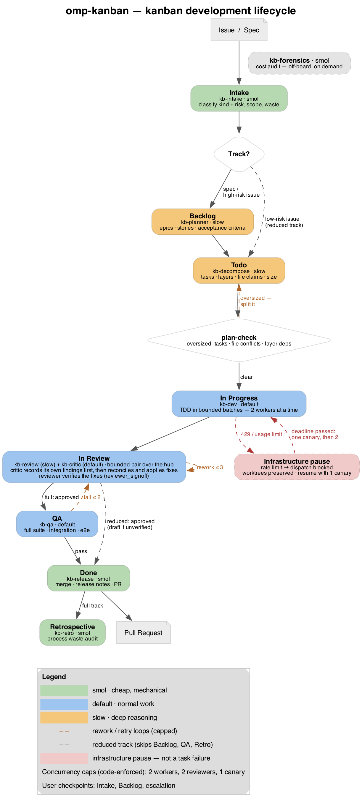

# omp-kanban

A kanban development lifecycle for [omp](https://omp.sh), built as ten subagents
and one skill.

Hand it an issue or a specification document. It plans the work into user stories
with testable acceptance criteria, implements tasks in parallel with strict TDD,
runs them past two review agents that argue over the hub and apply the fixes they
agree on, verifies the whole thing end to end, and opens a pull request with
release notes and an AC-to-test traceability table.

<p align="center">
  
</p>

The diagram above is generated from [`docs/kanban-flow.dot`](docs/kanban-flow.dot);
regenerate it with `dot -Tpng -Gdpi=150 docs/kanban-flow.dot -o docs/kanban-flow.png`.

## Install

```bash
git clone https://github.com/yurikilian/omp-kanban
cd omp-kanban
./install.sh
```

That installs to `~/.omp/agent/` for your user. To scope it to one repository
instead:

```bash
./install.sh --project    # installs into ./.omp
```

Other flags: `--dry-run` shows what would happen without writing, `--help` prints
usage. Re-running is safe — it only prompts if a file at the target differs from
the copy in this repo.

Then open omp, run `/agents`, and confirm the ten `kb-*` agents resolved. `Ctrl+R`
inside that view reloads from disk after any edit.

### Budget settings (recommended, opt-in)

Installing puts the guardrails hook in place, which caps how many agents the
board starts at once. The other half — how many rounds each agent may make, when
context is compacted, how much tool output comes back — is omp's own
configuration, so applying it is a separate, explicit step:

```bash
omp --config ~/.omp/agent/omp-kanban-guardrails.yml   # per run, reversible
./install.sh --apply-config                            # merge into config.yml
```

`--apply-config` backs up `config.yml` first and adds only keys you have not
already set. Every key it touches is documented, with omp's default and the
reason for the change, in **[docs/CONFIGURATION.md](docs/CONFIGURATION.md)** —
which also says plainly which limits are enforced in code, which are
configuration, and which are only instructions to the agents.

### Uninstalling

```bash
./uninstall.sh              # remove from ~/.omp/agent
./uninstall.sh --project    # remove from ./.omp
./uninstall.sh --dry-run    # show what would be removed, change nothing
```

This removes the agents, skill, the guardrails hook and its config overlay, and
the panel launcher hook. If you installed the vendored app with `--with-panel`,
that goes too. It is a thin wrapper over `install.sh --uninstall` (same effect;
one place for the removal logic). The panel's runtime state
(`~/.omp/agent/panel/`) is left in place — delete it by hand if you want it gone.

## The board

| Column | Agent | Role | Runs |
|---|---|---|---|
| Intake | `kb-intake` | smol | 1 |
| Backlog | `kb-planner` | slow | 1, spec input only |
| Todo | `kb-decompose` | slow | 1 |
| In Progress | `kb-dev` | default | 2 per batch, batches in sequence |
| In Review | `kb-review` + `kb-critic` | slow + default | 2, over the hub — one bounded pair |
| QA | `kb-qa` | default | 1 |
| Done | `kb-release` | smol | 1 |
| Post-cycle | `kb-retro` | smol | 1, skipped when trivial |

`kb-forensics` sits outside the board. Dispatch it when you want to know where
your tokens went.

The In Progress and In Review counts are caps, enforced in code by the guardrails
hook and counted across the whole workflow rather than per parent agent. During
recovery from a provider rate limit the cap drops to a single canary. See
[docs/CONFIGURATION.md](docs/CONFIGURATION.md).

Models are set by role, not by name, so they resolve against whatever you are
authenticated for. `slow` is reserved for the three places where a wrong call
compounds across the whole cycle — planning, decomposition, and first-pass
review. Everything mechanical runs on `smol`.

## Usage

The skill is description-gated, so it triggers on intent rather than an explicit
name:

```
implement the auth spec in docs/auth.md
```
```
fix issue #412 and open a PR
```
```
use the kanban-cycle skill to plan this out
```

For a first run, try it on something small and let it stop at the intake
checkpoint. It asks before planning, and the intake pass is cheap.

Each run gets its own directory under `.kanban/runs/<timestamp>-<slug>/`, so
concurrent invocations never collide. All board state for a run lives in one
SQLite file there, `kanban.db`, queried through the bundled `kb_db.py` helper —
never hand-edited. Add `.kanban/` to your `.gitignore`.

## Panel (optional)

A vendored Next.js app ships alongside the board. It reads
`~/.omp/agent/sessions/` and each run's `kanban.db` directly — no separate
server-side database — and shows session timelines, tool calls, KPI cards
(tokens, cost, message counts), and markdown plans, read-only, no session
creation. Its launcher hook installs always; build and install the app itself
with:

```bash
./install.sh --with-panel
```

That copies the app in and builds it (`npm install` + `next build`; heavier than
the light default install, which is why it is opt-in).

Once installed, the `session_start` hook launches it automatically — **once**.
It is a cross-session singleton: the first omp session starts a single panel
daemon on a random free port and prints the URL into the session; every later
session reuses that same one instead of opening another. The daemon outlives
the session that started it.

- The running instance is recorded in `~/.omp/agent/panel/state.json`.
- Stop it by killing the `pid` in that file.
- `OMP_PANEL_OPEN=1` also opens a browser tab on fresh start.
- `OMP_PANEL_DISABLED=1` skips the launcher entirely for a session.
- `OMP_PANEL_NODE` overrides the `node` binary used to run the daemon.

Without `--with-panel`, the app itself is never installed and the hook no-ops
on every session start — the agents and skill behave exactly as before.

## How the review works

Most of the design is conventional. The review column is not, so it is worth
explaining before you rely on it.

`kb-review` reads the diff and produces findings. `kb-critic` first forms its own
independent view — deliberately before reading those findings, because reading
them first anchors it, and `get findings --author reviewer` refuses to answer
until the critic has recorded findings of its own — then challenges the
reviewer's work over the hub. They argue
for at most two rounds, each conceding where the other is right. The critic then
reconciles the dispute into one verdict and **applies the surviving fixes
itself**. Finally the reviewer verifies those fixes in one closing round —
checking each resolves its finding and did not reach past it — and the critic
records the result in `reviewer_signoff`.

That sign-off is what keeps the collapsed design honest. Folding arbitration and
fixing into one agent removes a round-trip and a whole agent's worth of tokens,
but it would otherwise mean nobody reviews the critic's fixes. The reviewer's
independent check closes that gap without a third agent, restoring the separation
an evaluator-optimizer loop needs. `kb-critic` still carries its own guards — fix
only what survived reconciliation, write the failing test first, escalate rather
than let a fix grow — and the skill gates on `reviewer_signoff` and flags
fixes (queried with `get fixes`) reaching well past the findings that motivated
them.

The sign-off is one round, not a full second review. If you would rather have a
fully independent arbiter, split `kb-critic` into a ruling agent and a fixing
agent; the verdict schema already carries everything a separate fixer would need.

## Lean principles, as mechanism

Each of these changes a specific decision some agent makes, rather than sitting
in a doc nobody reads:

- **Small batches** — a task that cannot be described by one failing test gets
  split. `kb-planner` has no `L` estimate.
- **Build only what is asked for** — code no acceptance criterion requires is a
  reviewable defect category, not a style note. Both review agents hunt it.
- **Defer reversible decisions** — `kb-planner` records decisions with a trigger
  for when they must actually be made; `kb-decompose` refuses to write tasks that
  force them early.
- **Stop the line** — `kb-dev` reports pre-existing defects instead of fixing
  them drive-by, where a scoped review would never see the change.
- **Amplify learning** — `kb-critic` records root causes, `kb-qa` records escapes,
  `kb-retro` audits the cycle, and the PR body carries all of it to the humans who
  can act on it.
- **Optimize the whole** — every task passing its own tests says almost nothing
  about whether the system works, which is what `kb-qa` exists to check.

Concurrency is omp's job, not the skill's. `parallel_safe` in `kb-decompose` is
not a WIP limit — it is file-ownership analysis, marking tasks whose claimed
files overlap or that modify shared surface like routers, migrations, and
lockfiles. Worktree isolation does not prevent those from colliding at merge.

## Packaging

This ships as an omp extension. The manifest is a standard `package.json` with an
`omp` key:

```json
"omp": {
  "name": "omp-kanban",
  "description": "Kanban development lifecycle: ...",
  "extensions": []
}
```

`omp.extensions` is the only field omp reads — an array of `.ts`/`.js` entry
paths, each default-exporting a factory that receives `ExtensionAPI`. This
extension ships no factory: it is agents and a skill, and omp discovers those
**by directory name**, loading `agents/` and `skills/` as if you had placed them
under `~/.omp/agent/` yourself. The array stays present but empty because
`omp plugin install` expects the key.

Two things worth knowing if you fork this:

- Capability folders are convention, not manifest entries. Adding
  `"omp": { "agents": "./agents" }` does nothing — the key is not read, and it
  fails silently rather than erroring.
- Other keys resolve but are not wired to a runtime registry. A real plugin was
  broken for exactly this reason: it declared `omp.hooks`, the resolver returned
  the path, and nothing ever imported or executed it. `validate.py` warns on
  these.

Skills are discovered **non-recursively** — one directory deep under `skills/`.
`skills/kanban-cycle/SKILL.md` works; `skills/team/kanban-cycle/SKILL.md` would
not be found.

Install with `./install.sh` (copies into the documented `.omp` roots) or via
omp's plugin manager once published.

## Cost

The full board runs eight agents on a spec cycle. That is deliberate — the
separation between the agent that writes code and the agents that try to break it
is where the value is — but it is not cheap, and on a small change it costs more
than the change is worth.

So the full board is not the default for everything. The skill picks the track at
intake: specs and high-risk issues get the full board; a low-risk issue defaults
to a **reduced track** (decompose → dev → review pair → release, QA only when an
acceptance criterion needs real end-to-end wiring, no retrospective). Escalating to
the full board is an explicit choice; defaulting to fewer agents is the safe one.
For a one-line fix, it drops further still to `kb-dev` plus the review pair.

### The expensive failure, and what stops it now

One real cycle reached **291 million accumulated tokens** across 2,435 model
calls. **96.83% of that was cache reads**, there were **zero compaction events**,
the largest prompt hit 301K tokens, and individual workers made 100–170 model
rounds. Six of them ran at once. When the provider started returning 429s the
whole batch failed over to the fallback provider simultaneously and exhausted
that too; the retry launched all six again.

The mechanism is worth stating, because it decides which knobs matter: **a model
call re-sends the conversation so far.** A worker on its 150th round pays for
everything it has read, 150 times. Six workers multiply that. Cache reads make
each resend cheap, not free — and quota is spent either way.

So the board now bounds all three: how many sessions run at once (2, enforced in
code), how many rounds each makes (`task.softRequestBudget: 40`, hard-stopped by
omp at 60), and how much each round carries (task packets with only that task's
acceptance criteria, plus compaction at 100K tokens). A rate limit pauses
dispatch and preserves every worktree instead of stampeding the fallback, and
recovery starts with a single canary.

Full breakdown, including what is enforced in code versus configuration versus
prompt: **[docs/CONFIGURATION.md](docs/CONFIGURATION.md)**.

### Auditing what you did spend

`kb-forensics` audits where your tokens actually went. It discovers the session
JSONL schema rather than assuming it, reports honestly when something is not
measurable, and ranks its recommendations by expected saving — role
reassignment first, since that is usually the largest lever.

One thing it will tell you itself: auditing past spend does not refund it. The
value is entirely in what you change afterward.

## Status

Agent frontmatter and the `package.json` manifest are validated against omp's
documented schemas by `./validate.py`, which runs in CI. The validator catches
the failure modes that fail *silently* at runtime — an agent name colliding with
one of omp's bundled agents, a manifest key that resolves but is never wired, a
hook subscribing to an event omp does not dispatch, a shared guardrail block that
has drifted from its source, an `output` schema conflicting with a prose return
instruction.

`./tests/run.sh` adds behavioral tests: the run-state helper's task packets,
oversized-task detection, and review-independence gate under Python's `unittest`,
and the dispatch hook's concurrency caps, circuit breaker, and retry
deduplication under `node --test` with an injected clock. No dependencies beyond
Python 3 and Node 22.6+.

**The dispatch guardrails are tested; the board is still not exercised against a
live omp install.** The subagent `output` schemas are the most likely thing to
need adjusting if omp validates them more strictly than assumed. Run
`omp -p '/extensions'` and `/agents` after installing to see what actually
resolved and from where.

Issues and PRs welcome.

## License

MIT
